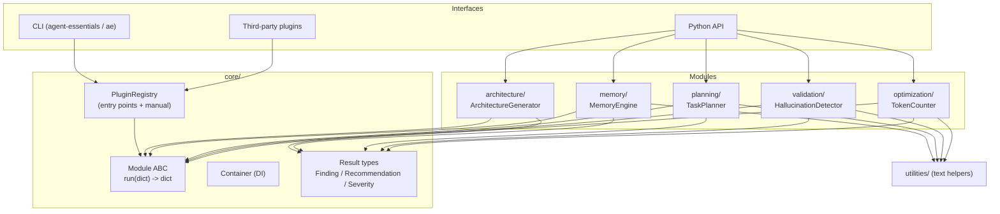

# Architecture overview

Agent Essentials is a **library of decision-support modules** around a tiny core.
There is no runtime, no scheduler and no agent loop — every module is a pure
function from a request to a structured recommendation.

## Layers

## Design rules

- **One uniform seam.** Every module implements `run(Mapping) -> dict`. The CLI,
  the registry and remote callers use that seam; direct Python users get a richer
  typed API (`generate`, `analyze`, `plan`, …).
- **Deterministic core.** Heuristics live in pure functions (`rules.py`,
  `checks.py`, `templates.py`) with no I/O — reproducible and easy to test.
- **Typed I/O.** Inputs and outputs are dataclasses that mix in `Serializable`,
  so any result converts to plain `dict`/JSON with `.to_dict()` / `.to_json()`.
- **Symmetric extensibility.** Built-in modules register through the *same*
  entry-point group third-party plugins use (`agent_essentials.plugins`).
- **Dependency discipline.** The core imports only the standard library. Optional
  power (`tiktoken`, provider SDKs) sits behind extras and never blocks the core.

## Request lifecycle

1. A caller builds a request (a dataclass, or a plain dict for `run`).
2. The module validates input (raising `ValidationError` on bad data).
3. Pure rule/check/template functions compute the decision.
4. The module assembles a typed result with findings and recommendations.
5. `to_dict()` yields JSON for the CLI / transport; Python callers keep the types.

## Package map

| Package | Responsibility |
|---|---|
| `core/` | ABCs, result types, plugin registry, DI, exceptions |
| `architecture/` | Architecture Generator (rules, knowledge, models) |
| `memory/` | Memory Engine (stores, embeddings, summarizers) |
| `planning/` | Task Planner (templates, graph algorithms) |
| `validation/` | Hallucination Detector (checks) |
| `optimization/` | Token Counter (pricing, tokenizers) |
| `research/`, `integration/` | Roadmap stubs |
| `utilities/` | Shared, dependency-free text helpers |
